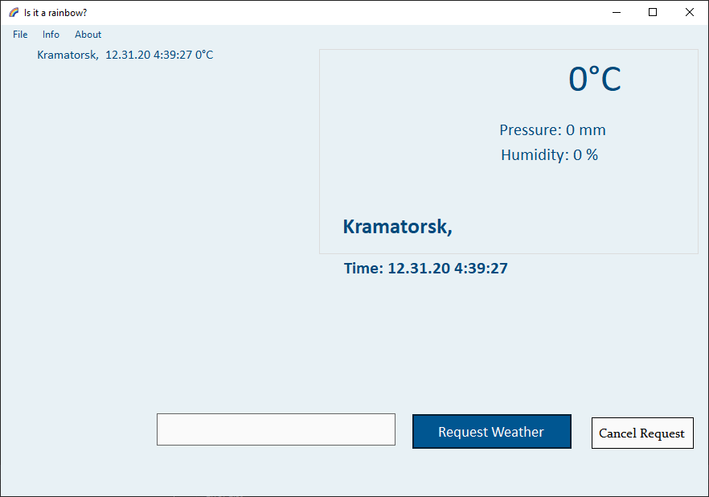
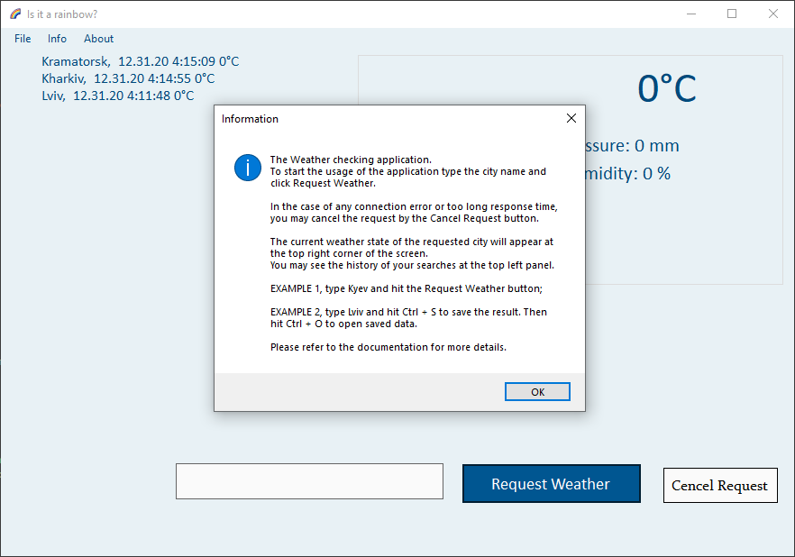
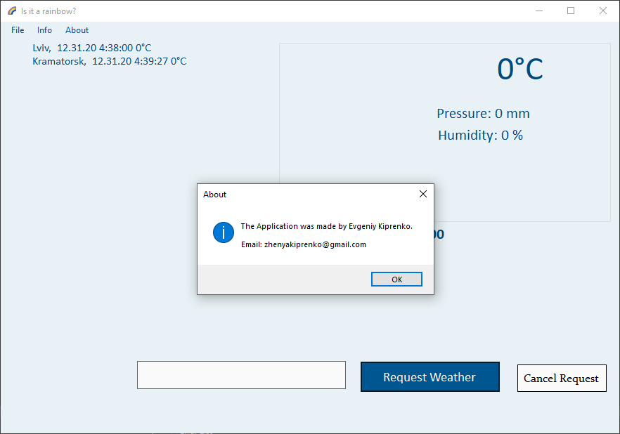

# rainbow-weather-app
A simple desktop application to check the current weather in any city in the world. Has such features: search history, weather data saving to JSON file, and weather data opening from a previously saved JSON file. The application checks the weather using https://openweathermap.org/ and is built using C#.

## Description
*Important:* the application works with https://openweathermap.org/ by HTTP requests. For the requests, the service requires an API ID. You may get your own API ID by creating an account on their site. Then, you need to put your ID to the special variable API_ID in the class MainForm.

The app can check the weather of the city. You need to pass the name of the city and click "Request Weather". See the example below.

In the top left corner, you may see your search history. This area is clickable and at any moment you may click on the item from the history to show the data of it. 
The application supports saving and opening previously saved data. You may save only the information about the current opened city. The saving and opening format is JSON.

The application also has a button to cancel the request. If you see that your request is proceeding too long, you can terminate it by the button "Cancel Request". 
The application has Info and About tabs. In the Info you may see a short user guide, in the about you may see the information about the developer.

Also, the application has an installer, so may install/uninstall it like a usual Windows application. The Installer setup is laying in the RainbowAppInstaller folder. 

That's it.

## Author :panda_face:

- Name: Yevgeniy Kiprenko
- Email: zhenyakiprenko@gmail.com
- [LinkedIn](https://www.linkedin.com/in/evgeniy-kiprenko/)
- [Telegram](https://t.me/Jus7XV)
